# W3C Solid Community Group: Weekly

* Date: 2023-08-02T14:00:00Z
* Call: https://meet.jit.si/solid-cg
* Chat: https://gitter.im/solid/specification
* Repository: https://github.com/solid/specification
* Status: Published

## Present
* [Sarven Capadisli](https://csarven.ca/#i)
* [Pierre-Antoine Champin](https://solid.champin.net/profile/card#me)
* [elf Pavlik](https://elf-pavlik.hackers4peace.net)
* April Daly
* Aaron Coburn
* [Virginia Balseiro](https://virginiabalseiro.com/#me)
* Wouter Termont
* [Ted Thibodeau](https://github.com/TallTed) // TallTed (he/him) (OpenLinkSw.com)
* Henry Story
* Hadrian Zbarcea

---

## Announcements

### Meeting Guidelines
* [W3C Solid Community Group Calendar](https://www.w3.org/groups/cg/solid/calendar).
* [W3C Solid Community Group Meeting Guidelines](https://github.com/solid/specification/blob/main/meetings/README.md).
* No audio or video recording, or automated transcripts without consent. Meetings are transcribed and made public. If consent is withheld by anyone, recording/retention must not occur.
* Join queue to talk.
* Topics can be proposed at the bottom of the agenda to be discussed as time allows. Make it known if a topic is urgent or cannot be postponed.

### Participation and Code of Conduct
* [Join the W3C Solid Community Group](https://www.w3.org/community/solid/join), [W3C Account Request](http://www.w3.org/accounts/request), [W3C Community Contributor License Agreement](https://www.w3.org/community/about/agreements/cla/).
* [Solid Code of Conduct](https://github.com/solid/process/blob/main/code-of-conduct.md), [Positive Work Environment at W3C: Code of Ethics and Professional Conduct](https://www.w3.org/Consortium/cepc/)
* Operating principle for effective participation is to allow access across disabilities, across country borders, and across time. Feedback on tooling and meeting timing is welcome.
* If this is your first time, welcome! please introduce yourself.

### Scribes
* elf Pavlik

### Introductions
* name: text

---

## Topics

### GitHub Discussions
URL: https://github.com/solid/specification/discussions

* SC: Thanks to eP for suggesting to enable GitHub Discussions. It should help us to better record and organise... discussions / "institutional" knowledge. Discussions, Issues/PRs and other features are well integrated. Off the shelf categories: announcements, general, ideas, polls, q&a, show and tell, but they can be modified.
* SC: Any (general) feedback? We can refer to Discussions from the [Contributing Guide](https://github.com/solid/specification/blob/main/CONTRIBUTING.md).
* SC: In the matrix, chat messages are not really linkable in the way they could be archived. Github has some default categories, we can change them around.

### Update mission
URL: https://github.com/solid/solid-wg-charter/issues/7

### Motivation still seems a bit vague
URL: https://github.com/solid/solid-wg-charter/issues/44

### Clarifying "Achieve Them" in Deliverables Section
URL: https://github.com/solid/solid-wg-charter/issues/45

### WG Charter

* AC: With regard to scope — Access Grants were initially in scope and later were removed when narrowing the scope. I was wondering about adding Access Grants back in. I was thinking about Access Management Lifecycle.
* SC: There is a part of the work related to integrating with existing specs. The other part is related to new specs. We don't have incubated specs in the CG. If it gets incubated in the CG, it could be advanced to the WG.
* eP: Access grants are used in interop although independent from Inrupt. We have had calls about how to reconcile the two. There's a pretty good overlap. I think we could see if they can be reconciled, and see later how much of the work will happen in the CG or as external effort to be contributed. 
* SC: Looking at the scope, it looks to fit the broader scope. If there is spec for Access Grants, it could be proposed.
* AC: One reason I was interested in calling out Access Grants, specifically — while it relates to AuthN and AuthZ, it is different, since it has the lifecycle aspect to it. There is prior work which was incubated in interop panel.
* eP: Reasonable to mention lifecycle specifically. 
* SC: Access Lifecycle Management. No particular deliverable. 
* WT: or Access Management Lifecycle.
* AC: +1 Access Management Lifecycle
* eP: +1
* SC: We had access grants in the CG charter, and we considered it covered by authn/authz. Should we make different decision in WG?
* WT: Here we talk more generaly about Access Management Lifecycle

PROPOSAL: Add Access Management Lifecycle to scope

* SC: Any objections?
* SC: maybe PAC can comment whether it's OK to add something to the scope while the charter is under horizontal review?
* PAC: We should only make editorial changes, but this may fit as such, as we seem to agree that it is already in scope, only making it more explicit
* SC: AC, go ahead with the PR.

ACTION: AC to PR

### WIP Implementation Feedback
* SC: We'll allocate some time for implementation feedback or interest to implement. Links to products/projects and demos welcome.
* SC: More on the future of this topic in [Solid Demos](#Solid-Demos) and other dedicated meetings.

#### Showcasing Notifications Protocol with WebhookChannel2023 and Access Matrix
URL: https://matrix.to/#/!QxZtVBYQfMeMTnespj:gitter.im/$GZIPDw2SP7CbOONQjd-TtSduD67UaJcFWRaOhBTF-_U

* SC: Proposed by eP.
* eP: This setup uses [SAI](https://solid.github.io/data-interoperability-panel/specification/) and takes advantage of [reciprocal Social Agent Registrations](https://solid.github.io/data-interoperability-panel/primer/authorization-agent.html#reciprocal-registration). Alice's Authorization Agent establishes [WebhookChannel2023](https://solid.github.io/notifications/webhook-channel-2023) to Social Agent Registration for Alice created by Bob in Bob's Agent Registry.
* eP: Next iteration will work without refreshing the app, when the app (Vuejectron) establishes [WebSocketChannel203](https://solid.github.io/notifications/websocket-channel-2023) to [Application Registration](https://solid.github.io/data-interoperability-panel/primer/application.html#application-registration) for Vuejectron created by Alice in Alice's Agent Registry.
* eP: [Access Authorizations](https://solid.github.io/data-interoperability-panel/primer/authorization-agent.html#access-authorization) and [Access Grants](https://solid.github.io/data-interoperability-panel/primer/application.html#access-grant) exemplify advantages of collapsing [Access Matrix](https://github.com/solid/authorization-panel/discussions/203#discussioncomment-610302) by agents. While ACP and WAC take advantage of collapsing the same Access Matrix by resources.

```mermaid
flowchart TB

  AliceAgentRegistry(["Agent Registry"])
  AliceAgentBob["👨 Bob"]

  BobAgentRegistry(["Agent Registry"])
  BobAgentAlice["👩 Alice"]


  BobAgentAlice -- :reciprocalRegistration ----> AliceAgentBob
  AliceAgentBob -- :reciprocalRegistration ---->BobAgentAlice

  subgraph auth.bob.example
    BobAgentRegistry -- :hasSocialAgentRegistration --> BobAgentAlice
  end

  subgraph auth.alice.example
    AliceAgentRegistry -- :hasSocialAgentRegistration --> AliceAgentBob
  end
```

### Solid Demos
* SC: Following https://github.com/solid/specification/blob/main/meetings/2023-07-19.md#solid-demos
* SC: There is a "Call for Group updates and Technical Demos (videos)" at TPAC2023. It is suggested that we showcase the work done in the Solid CG by creating a short video to be published on the TPAC2023 website. Videos are due by 2023-08-30. More details to follow, but there are [Best Practices for Recording Videos](https://www.w3.org/wiki/TPAC/2023/Demos_and_Group_updates#Best_Practices_for_Recording_Videos).
* SC: We have two separate cases to communicate/demo: 1) general CG work, and 2) specific use cases or interests.
* SC: For the time being, I suggest everyone self-publish their screencasts, and share the URLs with the CG. These are good assets. We can find a home to refer to those links. More details to follow; for instance, make sure the URL is publicly archivable by the Internet Archive.
* SC: Who is interested in have meeting for demos in 2 weeks?

### Add W3C Solid CG Charter
URL: https://github.com/solid/process/pull/323

* SC: Thank you to everyone approving and making improvements to the charter.
* SC: If you haven't yet reviewed, please review. This charter is by us for us!
* SC: Planned to be approved on 2023-08-08 and effective on 2023-09-01.

  
More details about the PR

  <ul>
    <li>30 days under review.</li>
    <li>22 participants.</li>
    <li>17 reviews and approvals, 0 change requests, 0 comments.</li>
    <li>4 thumbs-ups and 2 thumbs-downs emoji reactions on the original comment. Various exciting emojis throughout the PR.</li>
    <li>23 commits integrating feedback from the reviews, meetings, and elsewhere.</li>
    <li>191 conversations.</li>
  </ul>

#### Last Call for Review of the W3C Solid CG Charter
* SC: https://lists.w3.org/Archives/Public/public-solid/2023Aug/0000.html

#### MIT License and/or W3C CLA and FSA
* SC: https://github.com/solid/process/issues/327
* SC: We are trying to understand if we can use both or should just use one.
* SC: Rigo from W3C legal team offered us some help
* SC: General understanding is that W3C CLA and FSA are better going forward.
* SC: The charter currently says MIT license.
* HZ: I didn't find any clarification of the rationale for proposing the change of license? 
* eP: Rigo (W3C) mentioned that MIT license does not integrate well with W3C CG system. It mostly related to patents, and not just copyrights. 
* HZ: I don't know what *not integrating well with CG system* means. I think this is important to clarify and document very well.
* SC: CLA and FSA licences were put in place since they tie into W3C CG system.
* eP: Propose that we put in the charter that CG will use MIT+W3C licenses, following W3C guidance. We're not limited re vacations. We have a tracking issue / have a call with him. We don't actually reference implementations, the CG doesn't produce one. We can use MIT for reference. We can hyperlink from the CG charter to the W3C guidelines once we get feedback from W3C.
* SC: Sounds reasonable, what others think, PAC?
* PAC: +1 I think it makes sense

PROPOSAL: change MIT only to MIT + W3C CLA/FSA

* TT: +1
* VB: +1
* WT: +1
* eP: +1

TENTATIVE RESOLUTION: duality

* HZ: I would wait for @timbl to be present to express his point of view too.
* HZ: He expressed to keep MIT license, I understand that proposal is not to replace it but add another.
* TT: The question is what we are meaning by using both licenses. If we dual-license, the consumer can choose which one applies. If we decide to choose which one applies to what output, administration can get complex.
* eP: We would use MIT for code and W3C for specs and primers
* WT: With regard to the code in spec, but have never seen that in a spec before where MIT license code in there.
* SC: I think this is true; I think Tim refers to examples. Those examples are usually not running code copied-and-pasted from a specific product. https://solidproject.org/TR/#work-items
* SC: The examples that Tim gives are not in that list.
* SC: We can try to have a meeting where both Rigo and Tim are present.
* eP: I think we could also keep MIT and amend the charter later on.
* TT: Amending the charter is more challenging, it is almost as making it again.
* SC: Unless charter includes clause of going with the resolution of the issue.
* PAC: I think CG charters are not as strictly constrained by the W3C process -- I believe that the CG can decide on how to amend its own charter.
* PAC: but granted, this must be provisioned in the current charter.
* WT: we could add that the decision will be made before charter goes into effect.

### Security flows in OIDC spec

* HS: Ross wanted to present it during the meeting
* SC: We can ask them in chat to present it during the meeting
* 

### Rename 'Server' to something more specific — 'Resource Server' or 'Storage Server' or ...
URL: https://github.com/solid/specification/issues/548

### Return ETag headers on PUT requests
https://github.com/CommunitySolidServer/CommunitySolidServer/issues/632

* SC: Let's have additional eyes/minds on this. Cases in which the ETag header can(not) be used in `PUT` and `PATCH` responses. Potentially introduce a requirement or add advisory in Solid Protocol.

### Special Meetings
* SC: Noting here for now:
  * 2023-08-08: [Alternative solutions to container HATEOAS](https://github.com/solid/specification/issues/525).
  * 2023-08-15: Solid Demos.
  * yyyy-mm-dd: Implementer Feedback meeting.
  * yyyy-mm-dd: Reorganizing github repositories [related issue](https://github.com/solid/process/issues/324).
