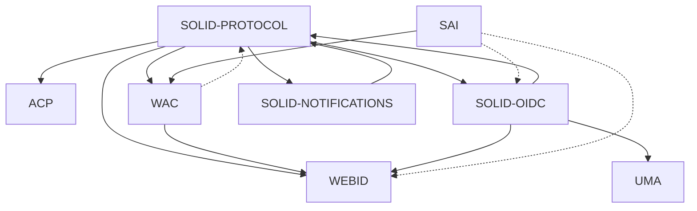

# W3C Solid Community Group: Weekly

* Date: 2023-10-25T14:00:00Z
* Call: https://meet.jit.si/solid-cg
* Chat: https://matrix.to/#/#solid_specification:gitter.im
* Repository: https://github.com/solid/specification
* Status: Published

## Present
* [Rahul Gupta](https://cxres.pages.dev/profile#i)
* Aaron Coburn
* [Pierre-Antoine Champin](https://solid.champin.net/pa/profile/card#me)
* [elf Pavlik](https://elf-pavlik.hackers4peace.net)
* TimBL
* Hadrian Zbarcea

---

## Announcements

### Meeting Guidelines
* [W3C Solid Community Group Calendar](https://www.w3.org/groups/cg/solid/calendar).
* [W3C Solid Community Group Meeting Guidelines](https://github.com/solid/specification/blob/main/meetings/README.md).
* No audio or video recording, or automated transcripts without consent. Meetings are transcribed and made public. If consent is withheld by anyone, recording/retention must not occur.
* Join queue to talk.
* Topics can be proposed at the bottom of the agenda to be discussed as time allows. Make it known if a topic is urgent or cannot be postponed.

### Participation and Code of Conduct
* [Join the W3C Solid Community Group](https://www.w3.org/community/solid/join), [W3C Account Request](http://www.w3.org/accounts/request), [W3C Community Contributor License Agreement](https://www.w3.org/community/about/agreements/cla/).
* [Solid Code of Conduct](https://github.com/solid/process/blob/main/code-of-conduct.md), [Positive Work Environment at W3C: Code of Ethics and Professional Conduct](https://www.w3.org/Consortium/cepc/)
* Operating principle for effective participation is to allow access across disabilities, across country borders, and across time. Feedback on tooling and meeting timing is welcome.
* If this is your first time, welcome! please introduce yourself.

### Scribes
* Aaron Coburn

### Introductions

---

## Topics

### WIP Implementation Feedback

* RG: Released [Solid-PREP](https://cxres.github.io/solid-prep/protocol/)! 
* RG: This describes the semantics for when notifications should be sent for Solid (LDP) resources
* RG: Not much to present, but a question came up from the CSS implementation: Pod is not used in the specification
* RG: Should we define that term?
* eP: I believe we moved away from Pod and use Storage now in any formal language.
* TBL: My feeling is that we should use the actual words. The W3C called everything a Resource, while OWL called it a Thing. It would be useful for the community for us to define Pod
* RG: The way I use the word, I am talking about resources stored in a Solid Pod
* eP: We still have a special topics meeting where we can discuss aligning terminology, and this would be a good item to include
* RG: +1
* RG: If anyone has other questions about Solid-PREP, please ask

### Update on WG charter

* PA: Created a number of [issues](https://github.com/w3c/charter-drafts/issues?q=is%3Aissue+is%3Aopen+wg%2Fsolid+in%3Atitle) and began addressing each issue on the [Solid CG version of the charter](https://github.com/solid/solid-wg-charter/pulls), starting with the easy ones
* PA: One issue that has received much discussion is the position of the WG with respect to other processes (i.e. Solid Process)
* TBL: Why would a W3C WG abide by non-W3C processes?
* PA: A W3C WG would not. There was a concern that the WG was injecting a new process, so a new paragraph was added to clarify that position
* PA: Some team members were concerned that adding such text would imply that other WGs _might_ use other processes
* TBL: By putting it in the charter you open the door to exactly what you  want to prevent.
* PA: Planning to close the issue without this change to the charter. Instead, there would be a comment to this effect
* TBL: What about the issue: solution vs. problem space
* PA: The common practice in W3C to have an incubation phase preceding the WG, so it is common that a WG would have some ideas about how to solve a given problem
* eP: Would it make sense to archive the Solid repo? So that we don't have issues/PRs across multiple repos?
* PA: This is still a moving target. I chose to make PRs in our repo b/c there would be a lot of discussion that may not be appropriate on the W3C repo -- this way the discussion is localized in the Solid CG
* TBH: The issue here relates to how ownership is passed from one group to another. GH is about moving things from one place to another
* PA: It would have been better to have the CG copy be a fork of the global W3C repo. Will deal with that
* PA: (back to the content) Two major issues to address: (1) Are we too narrow-minded to the solution space? Has been discussed that this isn't an overall solution to the larger personal datastore space. This is one particular solution based on one architecture (web architecture); if others are interested in pursuing this solution in other directions, they are free to create a new CG
* TBL: Yes, if others wish to create a new CG, they can and should do that, e.g. based on IPFS. IPFS, e.g., is great for archiving public data, such as the Web Archive. There hasn't been much use of this for private data, so big questions about personal data in the Web3/blockchain space. Also, IPFS is great for read-only, not so great for data that keeps changing. E.g. an archive of a Solid chat, but less well-suited for an active Solid chat.
* eP: There was discussion that proposed WG items need to be incubated (e.g. in a CG). For items that have not been incubated, they could be added to the Solid CG or some other CG. Given the requirement for incubation, the WG would not just take arbitrary items into scope
* PA: The question was less about incubation and more about the specificity of the proposed solution
* TBL: There are a lot of specs that have gone to REC without having lots of interoperable implementations. Solid, OTOH, already has working, interoperable code
* PA: (2) Another point relates to dependencies that do not have the maturity level of the future recommendationo. There was some text in the charter to address this, but reviewers were not convinved
* PA: I think the charter will need to be more specific/explicit about the status of the dependencies in terms of which are on REC track and which are not.
* TBL: Do we know which items reviewers were concerned about?
* PA: The one deliverable is the Solid Protocol, which mentions other items: Notifications, WebID, Solid-OIDC, WAC
* PA: We at least need our story to be straight, so that if some of those are not mature enough, the spec needs to have a good way to refer to those specifications in a non-normative way
* TBL: N3 patch is also one of those, N3 is also not REC
* TBL: WebID is really small, could be made part of the Solid Protocol or they could be done at the same time
* TBL: OpenID is more complicated
* TBL: WAC is very old with multiple implementations but hasn't gone through the REC process
* TBL: With notifications, these used to be defined in the Solid spec
* eP: Shared some [links in the chat](https://github.com/solid/specification/discussions/557#discussioncomment-6802365), we could discuss a special topic meeting in the next week related to which dependencies could be brought to the WG. 

* eP: I propose that next Tuesday we discuss this in a Special Topic meeting
* PA: This would be very useful, but we also need to keep in mind the strategy of this. ACP vs. WAC might be contentious in the CG, so defering to the WG was
* PA: It could be OK to say that the WG will decide, but that if a given document cannot be brought to REC track, describe a Plan B if a given item is too immature
* PA: Finding total consensus in the CG should not be a blocking point
* TBL: You mentioned that WAC vs. ACP have been contentious. I realized that there are two different visions/use cases that lead to different solutions. E.g. sharing photos with family vs. a hospital managing patient records. These lead to different authorization systems. GDPR (or other local laws) may require an authorization system that provide more features than what WAC allows 
* eP: As a CG we can at least clarify that WAC and ACP are alternatives or complementary. I.e. that the Solid Protocol can work with either. If one is standardized use of the other is still possible
* TBL: It's important that we don't have everything be optional. There should be one system that everyone can use
* PA: Last point that I wanted to raise was about the vision. We were prompted at TPAC to provide an [explainer](https://github.com/solid/solid-wg-charter/issues/52) with a high level view of what Solid is trying to achieve.
* PA: Many in the community already have information that would be helpful to reviewers in this context
* TBL: In hindsight, the voting period occurred during TPAC, but we didn't really use TPAC to promote Solid. It would have been better to have an "ask me anything about Solid" session, that would likely have been a better use of the TPAC time, and potentially diffused some of these
* PA: A more official item may have been helpful
* RG: One observation: people are projecting their own ideas onto Solid. There is a lack of material describing Solid
* TBL: they are also projecting their own CG experience onto Solid. The Solid CG is set up to work more like a WG
* eP: Is it still possible to offer something like this online to folks who have questions or concerns?
* TBL: that sounds like a reasonable option. I have been stepping back from much of this process. Perhaps a Solid World, openened up to ACs?
* PA: There is a monthly meeting of W3C representatives that could include a presentation of Solid. I will run this past the W3C Team to see if something emerges

### Feedback from special Solid-OIDC meeting

* AC: We had a meeting yesterday to discuss with security researchers various issues related to Solid-OIDC protocol.
* AC: There is a specific IETF draft which we would want to pull in as Solid-OIDC requirement to add an aditional layer of security.
* AC: On implementation side it is not particularly difficult to add.
* ...: There were 2 items and we went to one of them. We plan to schedule another meeting to go over the second item.
* eP: I will coordinate with Sarven to schedule the second meeting?

# Other business
* eP: is everyone ok with adding the dependencies/terminology meeting for next week and the Solid-OIDC follow-up for the following week?
* (general agreement)
