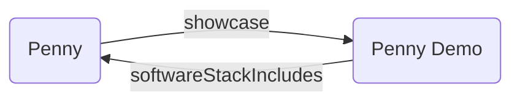

# W3C Solid Community Group: Weekly

* Date: 2025-06-11T14:00:00Z
* Call: https://meet.jit.si/solid-cg
* Chat: https://matrix.to/#/#solid_specification:gitter.im
* Repository: https://github.com/solid/specification

## Present
* elf Pavlik
* Hadrian Zbarcea
* Michiel de Jong
* Erich Bremer
* Jeff Zucker
* [TallTed // Ted Thibodeau Jr](https://github.com/TallTed) (he/him)
    - mastodon:[@TallTed](https://mastodon.social/@TallTed) (OpenLinkSw.com)
    - (lurking via hackmd.io; double booked)

## Regrets
---

## Announcements

### Meeting Guidelines
* [W3C Solid Community Group Calendar](https://www.w3.org/groups/cg/solid/calendar).
* [W3C Solid Community Group Meeting Guidelines](https://github.com/w3c-cg/solid/blob/main/meetings/README.md).
* No audio or video recording, or automated transcripts without consent. Meetings are transcribed and made public. If consent is withheld by anyone, recording/retention must not occur.
* Join queue to talk.
* Topics can be proposed at the bottom of the agenda to be discussed as time allows. Make it known if a topic is urgent or cannot be postponed.

### Participation and Code of Conduct
* [Join the W3C Solid Community Group](https://www.w3.org/community/solid/join), [W3C Account Request](http://www.w3.org/accounts/request), [W3C Community Contributor License Agreement](https://www.w3.org/community/about/agreements/cla/)
* [Solid Code of Conduct](https://github.com/solid/process/blob/main/code-of-conduct.md), [Positive Work Environment at W3C: Code of Conduct](https://www.w3.org/policies/code-of-conduct/)
* Operating principle for effective participation is to allow access across disabilities, across country borders, and across time. Feedback on tooling and meeting timing is welcome.
* If this is your first time, welcome! please introduce yourself.

### Scribes
* Hadrian Zbarcea

---

## Topics

### Solid Catalog — describing software and deployments

https://github.com/solid/catalog/issues/22

* eP: Jeff and I would like feedback on conflating software with its deployment
* eP: Talking to Jeff mostly about service implementations. There is a class 'product', and also deployments of servers
* ... I took 2 examples of deployments: Penny (describing metadata), there is a product section and the service section, which is distinct. There is a 'lauchAt' predicate. Another deployment is Discourse, similar metadata described by eP. There is a 'forum' deployment (lost connection)...
* JZ: It is intended to be Solid's public registry. People may want to use some of the apps. It's more aimed at the general public. Something like a 'service' or a 'product' is critical, but for the users at large it should be described in terms of what it does. That's a different approach than dividing by product/service. I am looking at a way to do both, by having a direct link from the 'product' to the author's presentation of the product.
* ... There wouldn't be a direct link from the product to the service. The SaaS is different from the product, but there may be links. You could use the interface to see if this is an author's deployment of a product.
* MdJ: Good showcase of RDF.
* eP: Do you want to link to the client-id or to the lauchAt.
* JZ: Needs to be 3 records: product, client-id, and demo location.
* eP: I created launchAt to see where you can load the app from. You can look at the client-id, but there is no guarantee that you can launch.
* ... We mostly talk about deployed web applications. If you deploy on your machine, there is no reason to have it in a catalog.
* MdJ: You want the 'product' to be in the catalog.
* eP: The software is the product, and the executing process is the service.
* JZ: I agree that there should be different records for the product and service. Once I saw eP's explanation, our views are aligned. I am ok with the way that's presented.
* MdJ: One product may have more than one service and each of them may have their own 'launchAt'
* JZ: It is not the product's responsibility to know where it's deployed. What I would like to do it differentate that case from when the author's says "this is where you can try it online"
* eP: The catalog is structured like a big resource with all the data there. If we want to later separate into multiple resource, I think it'll be feasible.
* ... The Solid ecosystem is still immature. In a year we may have multiple deployments of Penny with different terms of service.
* ... Maybe we want to have a more specific predicate or sub-property; there could be value.
* JZ: I said that eP's 'launchAt' satisfied the problem I raised, but it doesn't. Something like Penny is made to be deployed as many instances. I think it's valuable to go from the 'product' record to the 'author' deployment of it.
* eP: I think we should separate a few concerns. There is no reasoning, no inference in this model. I also think we need to describe the scenarios. With the catalog, if you want to find if there is a deployment by the author, we can correlate if the developer and maintainer are the same.
* ... Regarding finding the service from the product: of course you can find the service from the product, because in the end, we have a graph that can be queried. Direction is not a blocker.
* JZ: Currently, the way it's done is exactly as eP described. You don't necessarily need a field in the 'product' record, but it could be displayed in the UI, based on results of querying the graph.
* JZ: Every product has a status, which can be one of 4 values. Also, ODI is committed to this catalog. I hope that in the future somebody's duty will be to curate/maintain it. We cannot count on developers themselves to maintain the catalog; we need a process that's implemented on a regular basis.
* eP: I prefer that the catalog be well curated. It is useful to know how well an app works with a specific Solid product or service. It is useful to be able to report security problems.
* JW: For the wording of the PR, it is better to not say solidcommunity, as the service moved from NSS to Pivot.
* MdJ: The spec changed a few times, last version mentions UMA, that nobody really implemented. Parts of the spec have not been maintained for a few years.
* JW: I don't know about the authz implementation, for instance if Pivot uses WAC or ACP.
* ... I think it would be more accurate to say: these are the apps that currently work against solidcommunity.net.
* MdJ: That's fair. There are apps that work with other (trinpods), or multiple service providers.
* eP: At some point, I hope we'll have some kind of bar, like: you need to link at least one deployment that works. I don't think we should make solidcommunity.net a special case.
* MdJ: I agree with eP; I avoid mentioning solidcommunity.net specifically.
* JZ: It's not fair to say that because an app was not formally tested with a specific provider, it doesn't work at all. I think it would be ODI's responsibility to collect public feedback.
* MdJ: I consider myself a power user. If there's something I don't understand, it's fair to assume that it'll be hard to understand for a regular user.
* JW: I agree with the pragmatism, I am just saying that we should be precise.
* eP: I am proposing to mark those not touched in a long time as 'unmaintained'.

... discussion about the test harness
* JW: does the test harness use a common manifest language?
* eP: let's take a quick look.
* JW: I think we shoud use it, I don't know who has the authority to maintain that.
* ... at a first pass, I think we should ask Pete to maintain it.

---
#### Jeff's version

I cede to Pavlik's point that the Product and Service records of a SaaS are two different things, we do not need to debate that. Two points which remain are a) do we differentiate between an author-mounted deployment (e.g., Vincent mounts a demo of Penny) and other kinds of deployment (e.g., ServiceX uses Penny as a front-end); and b) how do we make sure that a visitor to the record knows that it is not necessary to download and build Penny in order to use it. There should be a clear indication on the Product record that you can go to URL X and use Penny for yourself. This is different from saying here are ten services which include Penny in their software stacks.

To deal with those issues, I suggest we use a predicate in the Product shape something like hasWebApp or authorDeployment which points from the record of a Product to a SaaS mounting of it by its owner. The SaaS would stil need to be a record in itself, but there would be a clear link from the Product to the Service.

Something like this:
```
<urlOfPennyRepo>
  a ex:Product;
  ex:hasWebAppAt <urlOfPennyDemo>.

<urlOfPennyDemo> # <-- clientID
  a ex:Service;
  ex:softwareStackIncludes <urlOfPennyRepo>.

<urlOfServiceUsingPennyFrontend> # <-- clientID
  a ex:Service;
  ex:softwareStackIncludes <urlOfPennyRepo>.
```

Unrelated — Discourse is not a Solid Resource by my definition. It is part of what is used to present a Solid Resource (the Solid Forum). Discourse should not have a record in the Solid Resources Catalog. I would simply list it as part of the Service stack with a URL pointing externally.  If, at some point in the future, there becomes a (please, yes) Solid alternative to Discourse or Matrix, or those apps add Solid compliance, those would definitely be listed in the Catalog and would themselves have both Product and Service records.

---
#### Pavlik's version

##### Discourse and Solid Project deployment

```
<https://www.discourse.org/dist>
  a ex:Product ;
  ex:name "Discourse" ;
  ex:repository <https://github.com/discourse/discourse> ;
  ex:language "Ruby", "Javascript" ;
  ex:license "GPL-2.0" ;
  ex:developer <https://github.com/SamSaffron> .
  # more devs
  
<https://id.solidproject.org/forum> # <-- Client ID
  a ex:Service ;
  ex:name "Solid Forum" ;
  ex:launchAt <https://forum.solidproject.org/> ;
  ex:provider <https://id.solidproject.org/solid-oid> ;
  ex:softwareStackIncludes <https://www.discourse.org/dist> ;
  ex:termsOfService <https://tos.solidproject.org/forum> .
```

##### Penny and demo deployment

```
<https://id.vincenttunru.com/penny>
  a ex:Product ;
  ex:name "Penny" ;
  ex:repository <https://gitlab.com/vincenttunru/penny> ;
  ex:language "Typescript" ;
  ex:license "GNU AGPLv3" ;
  ex:developer <https://vincenttunru.com/> .
  
<https://penny.vincenttunru.com/clientid.json> # <-- Client ID
  a ex:Service ;
  ex:name "Penny (demo)" ;
  ex:launchAt <https://penny.vincenttunru.com/> ;
  ex:provider <https://vincenttunru.com/> ;
  ex:softwareStackIncludes <https://id.vincenttunru.com/penny> .
```

#### Relations between Product(software) and Service(deployment)


JZ comment - Yes but `C --softwareStackIncludes-> A` does not imply `A --webAppAt--> C`

##### screenshot showing Client ID of Penny demo deployment 

(See comment in the snippet pointing at where that Client ID is used. The same case as WebID for a Person.)

### Auth as Data
https://youtu.be/iLp2xBMud10

* MdJ: does auth-as-data imply e2ee?

#### Test suite

https://github.com/solid-contrib/specification-tests
https://github.com/solid-contrib/conformance-test-harness
